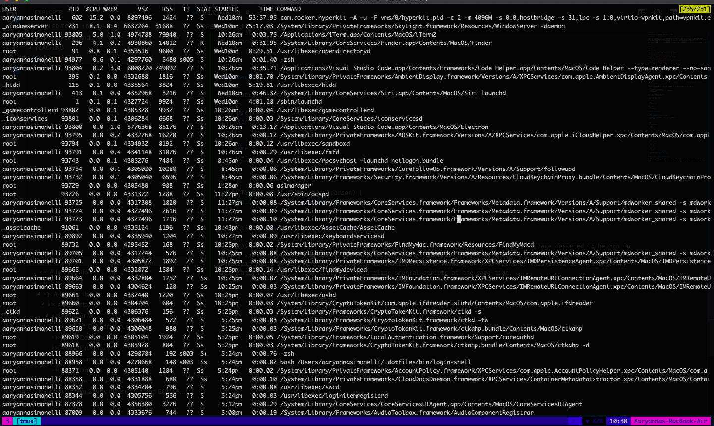

# Teaching

Teaching session for Southend high school for boys

# Introduction

ECMAScript (also known as ES) is a standardisation of JavaScript. Both are technically the 'same thing' however ECMAScript has more updated version like ES5, ES6, ES7, ES8 etc. ES6 is the most commonly spoken about on the internet at the moment however ES5 is the most common. ES5 being the original JavaScript or "vanilla".

When ES6 was released (the current engine used by google chrome) there were several additions such as classes for OOP (Object Orientated Programming) and 'async await' asynchronous methodology. 

# Section 1

## Cheatsheet

### Syntax

#### Semicolons

Semicolons are optional in ES6+. I'm old so I put them in.

#### Consts and lets 

Constants are 'constantly' only ever one thing. Like so:
```es6
const constant = 'I cannot be changed.';
```
Once a constant has been declared, you cannot redeclare a constant.
```es6
const constant = 'I cannot be changed.';
consant = 'I changed'; // will throw an exception
```

Let's are able to be redefined within the scope like so
```es6
let changeMe = 123;
changeMe = 333;
changeMe += 1;
console.log('changeMe', changeMe);
```
The above will output 
```
ChangeMe 334
```

#### Exceptions
An exception is like an error. If someone says 'throw an exception' it just means your saying something like "Hey, it didn't work."

```es6
throw new Error('I is error');
```
#### Functions
Function in ES are similar to any other language. You can define a global function like this

```es6
function IAmAFunction(parameter = 'test') {
  console.log(`IAmAFunction said this: ${parameter}`);
  return parameter;
}

const result = IAmAFunction('hello');
const result2 = IAmAFunction();
```
`result` will equal 'hello'. 
`result` will equal 'test'.

#### Objects 

```es6
const object = {};
```

#### Arrays
```es6
const array = [];
```

##### Cool array function

**filter**
```es6
const arrayOfNumbers = [1,3,4,7,2,8,10];

const under5 = arrayOfNumbers.filter(function (number) {
  return number < 5;
});
```

**map**
```es6 
const arrayOfPeople = [
  {
    name: 'Jeff',
    age: 20,
  },
  {
    name: 'Bob',
    age: 22,
  },
];

arrayOfStuff.map(function (person) {
  person.age++;
});
```

**forEach**
```es6 
const arrayOfPeople = [
  {
    name: 'Jeff',
    age: 20,
  },
  {
    name: 'Bob',
    age: 22,
  },
];

arrayOfStuff.forEach(function (person) {
  console.log(`Hello! ${person.name}!`);
});
```
## Section 2 Why use node.js and ECMAScript 

So ECMAScript is JavaScript and JavaScript has always been a front end, client based language designed to be run in client applications such as a browser these days. Node.js is a platform that enables you to use the language JavaScript as a backend process. A process is a script that's running on your machine. This could be anything! Any application running on your computer can utilise several scripts at the same time.  

Using the command `ps aux` on a linux based machine we can see a list of all the commands/processes running on that machine 



With node we can create a script and run that script using the node executable on your window computer. 

```cmd
C:\\ F:\nodejs\node.exe -e "console.log('hello!');"
```
### Using node.js as a web server compared to other servers 
Node is capable of running of as a web server by listen to a port on your machine. Compared to other web servers and languages nodejs is quite unique as it makes a clone of itself when a request is incoming. Meaning it spends less time 'booting' itself up.

Other web servers and languages usually take time booting themselves up so nodejs reduces the time a person is awaiting a response from the service. 

You can build a simple web server like so:

```es6
// server.js
const http = require('http');

const server = http.createServer(function (request, response) {
  console.log('we have a hit!');
  response.write('Hello!');
  response.end();
});

server.listen(3000, function() {
  console.log('Listening to port 3000 for requests');
});
```
You can run this script like so

```cmd
C:\\ F:\nodejs\node.exe server.js
```

Once the process prints the line "Listening to port 3000 for requests" the server is ready and listening! You can now request `http://localhost:3000/`. You should get a response back with `Hello!`

## Section 3 What can I do with it?

A common thing for all websites/services/agencies/client etc is something called REST or CRUD. Everyone seems to have their own interpretation of what those letters mean but basically it means that you can Create, Review, Update, Delete something. 

Let's say that we have a website that sells cats. In order to display what cats we have on our website we need to be able to create a cat. We also need to be able to see all the cats and usually show 1 cat at a time. 

For now we'll miss out Create, Edit and Delete and focus on the different Review actions to start simple.

We do this by using something known as the URI. A URL (not URI) is something like `http://buymycats.com/cats/tom-cat`. The URI is the part after the `.com` or `.co.uk` or whatever our domain is. So on our server we can tell what people are requesting. If the URI is `cats/` we want to get all cats. If the URI is `cats/tom-cat` we want a cat with the name `tom-cat`.

In this example is a file called `cats.json` this file contains an array of cats in the JSON format.

#### What to do 

So we have this file called `cats.json`, we want to read the file and return the contents of the file to the user making the request. We can read the file using a library supplied by nodejs. 

```es6
const fs = require('fs');
```
`fs` stands for 'file-system'. No idea why they didn't call it that but yea.

We can use fs to read our file and get our cat objects.

```es6
const fs = require('fs');

let cats = [];

const fileContent = fs.readFileSync('./cats.json', 'utf8');

cats = JSON.parse(fileContent);
```

Now we have our cats! Now we've got to render them to the user making the request. But! Only when the URI is `cats` and nothing else. 

```es6
const http = require('http');

const fs = require('fs');

let cats = [];

const fileContent = fs.readFileSync('./cats.json', 'utf8');

cats = JSON.parse(fileContent);

const server = http.createServer(function (request, response) {
  response.writeHead(200, {'Content-Type': 'application/json'});
  
  switch (request.url) {//confusing I know, node calls uri url :thumbs-up: well done nodejs
    case 'cats':
    case '/cats':
    case '/cats/':
    case 'cats/':
      response.send(cats);
      break;

    default:
      response.writeHead(404);
      response.send('Invalid URI');
  }

  response.end();
});

server.listen(3000, function() {
  console.log('Listening to port 3000 for requests');
});
```

### Using slugs

So you might of noticed in the JSON there's a key called `slug` in the dev world we use this work to determine a unique name of our objects. Or in this instance our cats. Our cats each have a name but! This name isn't always unique! So we have a unique name for them and this is called a slug. It's the same for username's on some social media sites and the like. 

So to get our cat we need to request it using the slug like so `http://localhost:3000/cats/luke-skywalker`. To return the cat Luke Skywalker we need to find him in the array and return him. We can do that like so

```es6

const slug = 'luke-skywalker';

const matches = cats.filter(function (cat) {
  return cat.slug === slug;
});

```

`cats.filter` will return an array of cats that have the slug which matches `luke-skywalker`. We know that there can be only one so this array will either contain 1 cat object or nothing. From this we can determine that what the user has asked for exists. Because if there are no objects in the array then the user requested something that doesn't exist and we can tell them to go away because we canny do what they asked. 

```es6
if (matches.length !== 1) {
  res.writeHead(404); // 404 is the http status code for not found.
}
```

#### So how do we do this in our server?

Using something called 'regular expressions' or Regex for short, we're going to check to see if our URI contains 

```es6
const http = require('http');

const fs = require('fs');

let cats = [];

const fileContent = fs.readFileSync('./cats.json', 'utf8');

cats = JSON.parse(fileContent);

const server = http.createServer(function (request, response) {
  response.writeHead(200, {'Content-Type': 'application/json'});

  if (request.url.test(/^\/cats\/\w+/)) {
    const uriParts = request.url.split('/');
    const slug = uriParts[1]; // because [0] => cats, [1] => luke-sykwalker

    const matches = cats.filter(function(cat) {
      cat.slug === slug;
    });

    if (matches.length !== 1) {
      response.writeHead(404);
      response.send('Cat not found');
      return;
    }

    response.send(matches[0]);
    return;
  }
  
  switch (request.url) {
    case 'cats':
    case '/cats':
    case '/cats/':
    case 'cats/':
      response.send(cats);
      break;

    default:
      response.writeHead(404);
      response.send('Invalid URI');
  }

  response.end();
});

server.listen(3000, function() {
  console.log('Listening to port 3000 for requests');
});
```

## Section 4 Cleaning up

